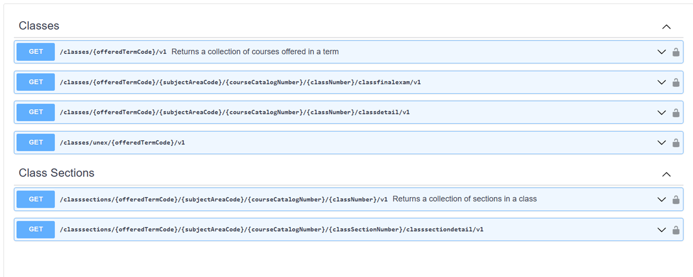
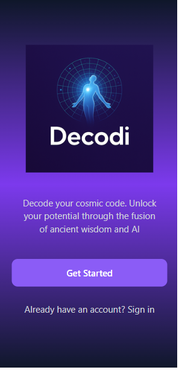
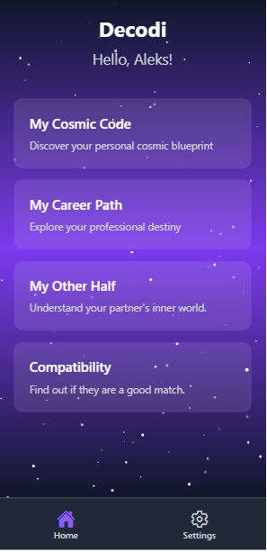

# 📘 About Me

An experienced Software Engineer with 20+ years building enterprise systems, SaaS platforms, and native mobile applications.
I specialize in taking projects from idea → architecture → development → production release across backend, frontend, cloud, and mobile.

I enjoy designing clean systems, solving complex problems, and delivering applications that users trust and enjoy.
Continuous learning and refining modern engineering practices is a core part of my workflow.

# 🚀 What I Do

- Build full end-to-end software solutions from scratch
- Architect scalable backend systems, microservices and API-driven platforms
- Develop cross-platform mobile apps with modern UI/UX
- Integrate authentication, cloud infrastructure, and CI/CD
- Deliver complete SaaS platforms ready for production use
- Analyze and choose the right technologies for long-term stability
- Modernize and upgrade legacy systems with scalable, maintainable architectures
- Improve business processes by integrating modern tools and cutting-edge technologies

# 💻 Tech Stack

### Languages & Frameworks

---

### Cloud & DevOps

**Azure PubSub**

---

### Data & Persistence

**Memcached, T-SQL, and Stored Procedures**

---

### Security

---
### Architecture & Methodologies

---

### Mobile Development

---

### Tools

---
### 🧪 Testing & Integration

- Unit Testing (xUnit)  
- API Integration Testing  
- End-to-End (E2E) Testing  
- Test-Driven Development (TDD)  
- Mocking & Dependency Injection for isolated testing  
- Automated testing workflows in CI/CD pipelines  
- Postman Collection Testing  
- Debugging, diagnostics, and structured logging  

---

# ⭐ Featured Work

## 📌 SAIT API SOA Platform 

**Live Project:** [View Project](https://developer.api.ucla.edu/api-catalog)

A large-scale enterprise API platform built as part of the UCLA Student Affairs IT team, where I contributed as the technical lead.
The platform consisted of 250+ secure REST APIs supporting mission-critical university applications.
It included versioning support, authentication layers, caching strategies, performance optimization, developer tooling, and full API governance integration through Apigee.

**Tech Stack:**  
ASP.NET Web API, C#, SQL Server, Entity Framework, Swagger/OpenAPI, JWT, OAuth, Apigee, Caching, Distributed Systems, Azure Hybrid Cloud

---

## 📌 Swagger Split Tool  

**Live Project:** [View Project](https://developer.api.ucla.edu/api-catalog)

A custom-built tool designed to split large Swagger/OpenAPI files into smaller, modular components, allowing teams to group relevant APIs on the same page while cleanly excluding the rest. This greatly improves documentation clarity, navigation, and maintainability across large API ecosystems.

**Tech Stack:**  
.Net WinForms C#  

---

## 📌 Decodi – AI-Powered Mobile Astrology Platform  

**Live App:**  
- Google Play: *coming soon*  
- App Store: *coming soon*

A full SaaS ecosystem with a native mobile application, authentication system, subscription management, custom identity microservice, and an astro business-layer microservice with rich AI integrations.
Designed and built end-to-end: architecture, backend, frontend, mobile, cloud deployment, CI/CD, and the full production release pipeline.

The platform also includes a custom-built application framework designed from scratch, featuring:
- Authentication Flow with JWT (Access + Refresh Tokens)
- Resource-based Authorization Access System
- Version Upgrade Check and Enforcement Layer
- Comprehensive Logging and Diagnostics Integration
- User Onboarding Flow
- Paywall & Subscription Access Logic (RevenueCat Integration)

**Tech Stack:**  
React Native (Expo), .NET Core Web API, PostgreSQL (Supabase), JWT Auth, RevenueCat, WebHooks, Azure, Docker, Ngrok, OpenAI Api, Ngrok, Resend Email, Android Studio (Emulators, Logcat), AI-Assisted Development Tools

---

# 📫 Connect With Me

Whether you're curious about my experience, interested in working together, or just want to say hi, I’d be glad to hear from you.

📧 Email: edoncell12@gmail.com 
🔗 LinkedIn: 
<a href="https://www.linkedin.com/in/eddy-mishiyev-01bb844">
 
</a>

 
